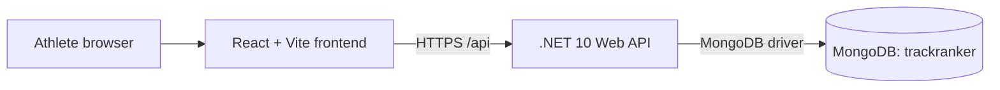

# Technical architecture

## Frontend architecture

The frontend is a React and TypeScript single-page application built with Vite. React Router owns route composition, while a responsive application shell provides shared navigation and layout. Page, component, configuration, and API service concerns are kept in focused modules. Vitest, jsdom, and React Testing Library test observable user behaviour.

## Backend architecture

The backend is a .NET 10 ASP.NET Core Web API using controllers. Startup composition remains in `Program.cs`; request contracts live separately, and future business logic will belong in injected services rather than controllers. Built-in OpenAPI generation supplies a document rendered through Scalar during development.

## MongoDB approach

The official MongoDB .NET driver supplies `IMongoClient` and `IMongoDatabase` through dependency injection. Strongly typed, validated options hold connection and database settings. No collections or domain models are created in milestone 1. Future persistence will use repository boundaries, validated backend models, and DTOs.

## Environment configuration

ASP.NET Core's configuration providers read hierarchical settings from JSON and environment variables. Safe defaults exist only in development configuration. Production startup fails clearly when required MongoDB or frontend origin configuration is absent. Vite reads `VITE_API_BASE_URL` with a safe localhost fallback.

## Testing approach

Backend xUnit tests host the API in memory and verify the health contract without MongoDB access. Frontend component tests mock `fetch`, verify rendering and routing, and do not depend on a live backend. Both applications must build after their test suites pass.

## Planned deployment architecture

The current plan is to deploy the compiled frontend to static hosting, the .NET API to a managed application host, and MongoDB to a managed database provider. Concrete vendors, secrets management, observability, and CI/CD will be decided in later milestones.

