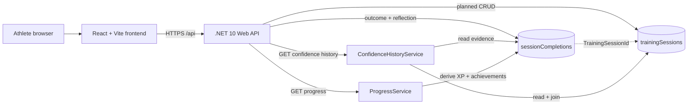

# Technical architecture

## Frontend architecture

The frontend is a React and TypeScript single-page application built with Vite. React Router owns route composition, while a responsive application shell provides shared navigation and layout. Training-session list, create, detail, and edit pages share a focused form component. Zustand owns only persistent client UI state: the unfinished new-session draft and session/confidence filters. Server data continues to load through the typed API service and remains outside the store. A reusable completion form supports ratings, dynamic repetition results, reflection, and confidence capture on `/sessions/:id/complete`. `/confidence` loads a typed confidence-history response, while `/progress` displays derived XP, TrackRank, process totals, and achievements. The Dashboard loads small recent-training and TrackRank summaries independently so either request may fail without blocking the other. Vitest, jsdom, and React Testing Library test observable user behaviour.

## Backend architecture

The backend is a .NET 10 ASP.NET Core Web API using controllers. Startup composition remains in `Program.cs`. Training-session and session-completion controllers depend on application services, which validate and map separate request/response DTOs to internal persistence models. Read-only confidence and progress controllers call dedicated services. `ProgressService` reads current completion evidence through the existing repository and deterministically calculates XP, TrackRank, process totals, and six achievement DTOs; no gamification state is persisted. Services depend on repository abstractions, and only MongoDB repositories contain database queries. Built-in OpenAPI generation supplies a document rendered through Scalar during development.

## MongoDB approach

The official MongoDB .NET driver supplies `IMongoClient` and `IMongoDatabase` through dependency injection. Strongly typed, validated options hold connection and database settings. Planned training sessions are stored in `trainingSessions`; actual outcomes and reflections are stored separately in `sessionCompletions`, with a unique index on `TrainingSessionId`. Repository boundaries, validated request DTOs, and response mapping keep persistence details out of the API contract. Completion creation and the parent status update span two collections without a MongoDB transaction, so they are sequential rather than atomically committed.

## Environment configuration

ASP.NET Core's configuration providers read hierarchical settings from JSON and environment variables. Safe defaults exist only in development configuration. Production startup fails clearly when required MongoDB or frontend origin configuration is absent. Vite reads `VITE_API_BASE_URL` with a safe localhost fallback.

## Testing approach

Backend xUnit tests host the API in memory for the health contract and test training-session and completion application behaviour with fake repositories, avoiding a live database dependency. Frontend component tests mock the typed API layer and verify planned-session plus completion/reflection workflows. Both applications must build after their test suites pass.

## Planned deployment architecture

The current plan is to deploy the compiled frontend to static hosting, the .NET API to a managed application host, and MongoDB to a managed database provider. Concrete vendors, secrets management, observability, and CI/CD will be decided in later milestones.

