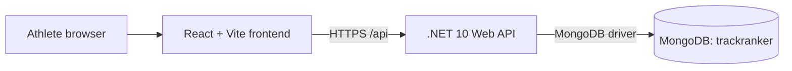

# Technical architecture

## Frontend architecture

The frontend is a React and TypeScript single-page application built with Vite. React Router owns route composition, while a responsive application shell provides shared navigation and layout. Training-session list, create, detail, and edit pages share a focused form component and use a typed API service rather than calling `fetch` directly. Page, component, type, configuration, and API concerns are kept in focused modules. Vitest, jsdom, and React Testing Library test observable user behaviour.

## Backend architecture

The backend is a .NET 10 ASP.NET Core Web API using controllers. Startup composition remains in `Program.cs`. Training-session controllers depend on an application service, which validates and maps separate request/response DTOs to the internal persistence model. The service depends on a repository abstraction, and only the MongoDB repository contains database queries. Built-in OpenAPI generation supplies a document rendered through Scalar during development.

## MongoDB approach

The official MongoDB .NET driver supplies `IMongoClient` and `IMongoDatabase` through dependency injection. Strongly typed, validated options hold connection and database settings. Training sessions are stored in the `trainingSessions` collection as documents with string-represented enums and UTC timestamps. Repository boundaries, validated request DTOs, and response mapping keep persistence details out of the API contract.

## Environment configuration

ASP.NET Core's configuration providers read hierarchical settings from JSON and environment variables. Safe defaults exist only in development configuration. Production startup fails clearly when required MongoDB or frontend origin configuration is absent. Vite reads `VITE_API_BASE_URL` with a safe localhost fallback.

## Testing approach

Backend xUnit tests host the API in memory for the health contract and test training-session application behaviour with a fake repository, avoiding a live database dependency. Frontend component tests mock the typed API layer and verify list, empty, form, detail, and delete-confirmation flows. Both applications must build after their test suites pass.

## Planned deployment architecture

The current plan is to deploy the compiled frontend to static hosting, the .NET API to a managed application host, and MongoDB to a managed database provider. Concrete vendors, secrets management, observability, and CI/CD will be decided in later milestones.

